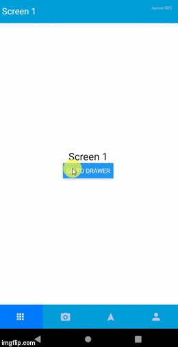

#  react-native-navigation-start



This package includes a Drawer Navigation template, using React-native 0.60, Native Base 2.13.0 and React-Navigation v.4. Take a look at the package.json file for more details.

## Dependencies
[React Navigation](https://github.com/react-navigation/react-navigation).
[Native Base](https://docs.nativebase.io/docs/GetStarted.html).
Since react-navigation v4, packages bellow were moved to a single repository.
[React Navigation Drawer](https://github.com/react-navigation/drawer).
[React Navigation Stack](https://github.com/react-navigation/stack).

## Installation

1. Clone the repository.
2. npm install.
3. You may need to install this and link them manually:
```bash
yarn add react-native-reanimated react-native-gesture-handler
react-native link react-native-reanimated
react-native link react-native-gesture-handler
```
4. Open the console and 
```bash
run npx react-native run-android
or
run npx react-native run-ios
```
## Contributing
Pull requests are welcome. For major changes, please open an issue first to discuss what you would like to change.

Please make sure to update tests as appropriate.
